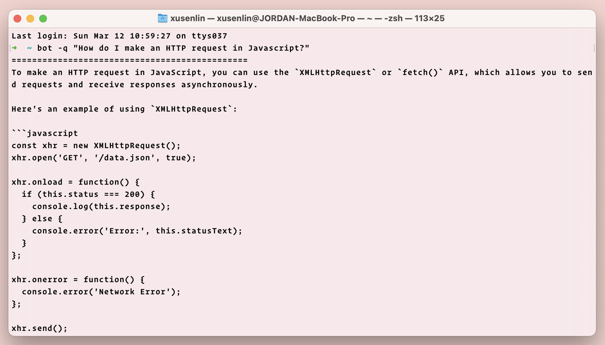
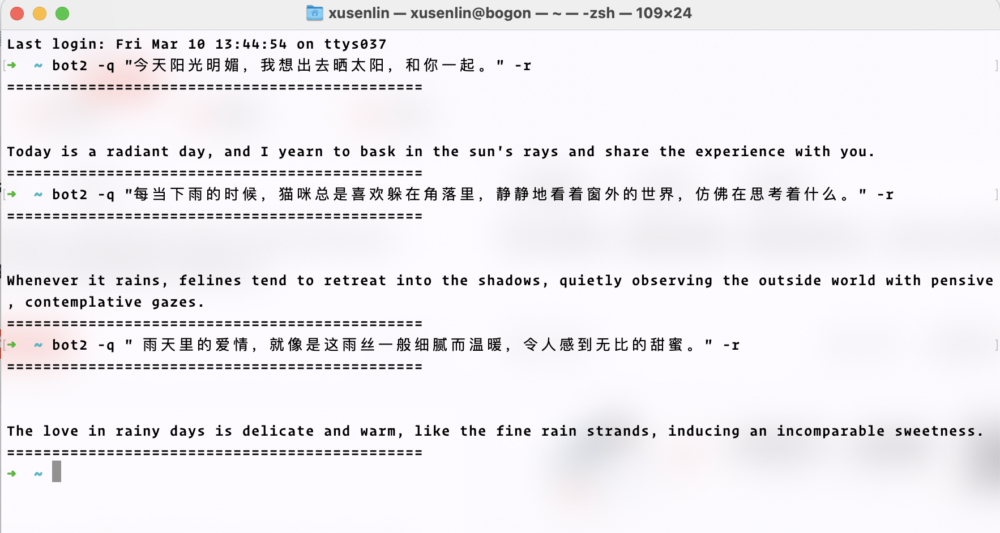

# terminalBot

# Table of Contents
- [Introduction](#Introduction)
- [Screenshots](#Screenshots)
- [Features](#Features)
- [Installation](#Installation)
- [Usage](#Usage)
- [Contribution](#Contribution)
- [License](#License)

## Introduction

terminalBot 是一个终端机器人， 可以将chatGPT接入你的终端，以最快的方式提问。通过配置 prompt,我们能在终端里拥有各式各样的小助手。

terminalBot is a terminal robot that can integrate chatGPT into your terminal for fast questioning. By configuring the prompt, we can have various assistants in the terminal.


> https://github.com/xusenlin/chatGPT 是一个简单(仅一个go和一个html源代码文件)易用的WEB chatGPT,支持代码高亮。

## Screenshots




## Features
- 自定义 authToken、proxyURL、questionPrefix、prompt
- 上下文对话功能
- 可以使用-r参数重置对话

- Customize authToken, proxyURL, questionPrefix, and prompt.
- Contextual conversation.
- The conversation can be reset using the `-r` parameter.

## Installation
在github发布页下载对应平台的压缩包文件，解压之后将bot二进制文件放在环境变量能访问的位置，
然后将bot.json配置文件移动到 ```你的用户目录/terminalBot/bot.json``` 下，编辑配置文件填入你的authToken。然后就可以在终端使用```bot -q "问题"``` 来提问了。
同时，我们可以复制bot二进制文件重命名为bot2，然后添加配置 ```你的用户目录/terminalBot/bot2.json```，并编辑配置里面的prompt，这样你就拥有另外一个小助手了。

Download the corresponding platform's compressed package file from the GitHub release page. Once unzipped, place the bot binary file in a location accessible to environment variables. Move the bot.json configuration file to your user directory /terminalBot/bot.json, edit the configuration file with your authToken, and the bot can then be utilized in the terminal with bot  -q "question"'.
Additionally, copying the bot binary file and renaming it as bot2 can provide another assistant by configuring 'your user directory/terminalBot/bot2.json' and adjusting its prompt.
### bot configuring

```json
{
  "authToken": "your authToken",
  "proxyURL": "http://127.0.0.1:7890",
  "questionPrefix": "",
  "questionSuffix": "",
  "prompt":[
    {
      "role": "system",
      "content": "You are a terminal chat GPT developed by xusenlin and named TerminalBot."
    }
  ]
}
```

### bot2 configuring

```json
{
  "authToken": "your token",
  "proxyURL": "http://127.0.0.1:7890",
  "questionPrefix": "I want you to act as an English translator, spelling corrector and improver. I will speak to you in any language and you will detect the language, translate it and answer in the corrected and improved version of my text, in English. I want you to replace my simplified A0-level words and sentences with more beautiful and elegant, upper level English words and sentences. Keep the meaning same, but make them more literary. I want you to only reply the correction, the improvements and nothing else, do not write explanations. My first sentence is \"",
  "questionSuffix": "\"",
  "prompt": []
}

```

### bot3 变量取名神器
```json
{
  "authToken": "your token",
  "proxyURL": "http://127.0.0.1:7890",
  "contextEnabled": false,
  "questionPrefix": "请根据大多数知名源代码帮我取一个变量名，它用来表示\"",
  "questionSuffix": "\"",
  "prompt": []
}
```


## Usage
```bot -q "How do I make an HTTP request in Javascript?" -r```

The -r here serves the purpose of initiating a new conversation. If your dialogue does not necessitate contextual coherence, employment of -r can diminish token consumption.

这里的-r用来重新开始对话，如果你的对话不需要上下文相关，使用-r可以减少token使用。
## Contribution
Feel free to open issues or pull requests if you have any suggestions or found any bugs.

## License
This project is licensed under the MIT License.
