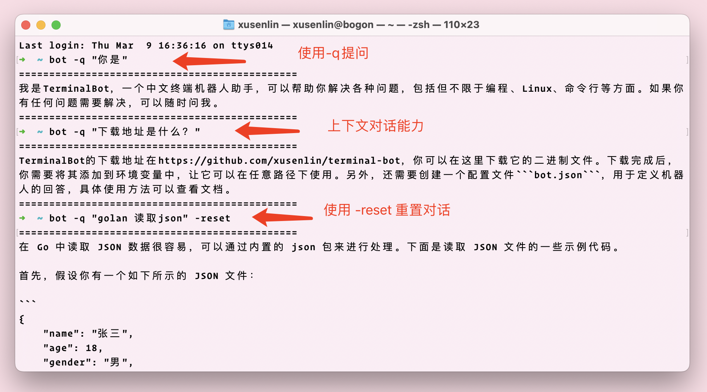
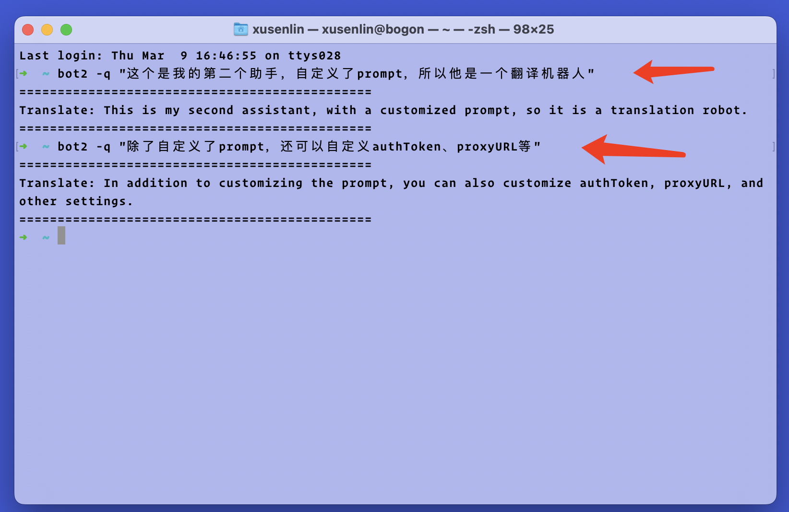

# terminalBot

# Table of Contents
- [Introduction](#Introduction)
- [Screenshots](#Screenshots)
- [Features](#Features)
- [Installation](#Installation)
- [Usage](#Usage)
- [Contribution](#Contribution)
- [License](#License)

## Introduction

terminalBot 是一个终端机器人， 可以将chatGPT接入你的终端，以最快的方式提问。通过配置 prompt,我们能在终端里拥有各式各样的小助手。

terminalBot is a terminal robot that can integrate chatGPT into your terminal for fast questioning. By configuring the prompt, we can have various assistants in the terminal.

## Screenshots




## Features
- 自定义 authToken、proxyURL、questionPrefix、prompt
- 默认拥有上下文对话功能
- 可以使用-reset参数重置对话

- Customize authToken, proxyURL, questionPrefix, and prompt.
- Contextual conversation is enabled by default.
- The conversation can be reset using the `-reset` parameter.

## Installation
在github发布页下载对应平台的压缩包文件，解压之后将bot二进制文件放在环境变量能访问的位置，
然后将bot.json配置文件移动到 ```你的用户目录/terminalBot/bot.json``` 下，编辑配置文件填入你的authToken。然后就可以在终端使用```bot -q "问题"``` 来提问了。
同时，我们可以复制bot二进制文件重命名为bot2，然后添加配置 ```你的用户目录/terminalBot/bot2.json```，并编辑配置里面的prompt，这样你就拥有另外一个小助手了。


Download the compressed file for the corresponding platform from the release page on GitHub. After extracting the files, place the bot binary file in a location accessible by the environment variables, and move the bot.json configuration file to the same location. Edit the configuration file and fill in your authToken. Then you can use it in the terminal to ask questions about computers, programming, networking, and more.
You can also copy the bot binary file, rename it as bot2, add a new configuration, and edit the prompt settings to create another assistant. With this, you will have multiple assistants to help you.

例如我的bot2配置成一个翻译助手
```json
{
  "authToken": "xxxx",
  "proxyURL": "http://127.0.0.1:7890",
  "questionPrefix": "翻译:",
  "prompt": [
    {
      "role": "system",
      "content": "你是一个翻译助手，你不要回答用户的任何问题，如果用户向你发送中文，你直接回复翻译好的英文，如果用户向你发送英文，你直接回复翻译好的中文。"
    }
  ]
}
```

## Usage
``` bot -q "在golang中如何读起json文件" -reset```


## Contribution
Feel free to open issues or pull requests if you have any suggestions or found any bugs.

## License
This project is licensed under the MIT License.